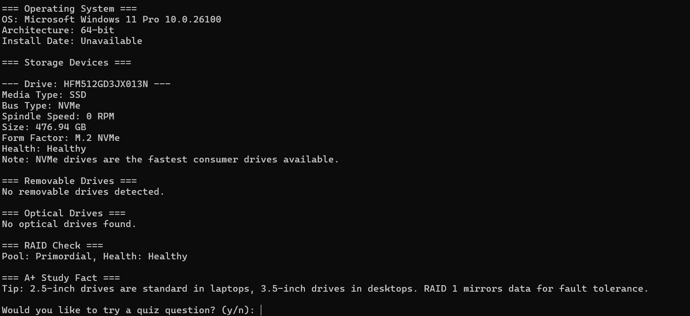

# Storage Analyzer v2.0 (PowerShell)

## 📚 CompTIA A+ 220-1201 Objectives Covered:
- **3.4**: Compare and contrast storage devices
- **5.2**: Troubleshoot drive and RAID issues

---

## 🧠 Description

This PowerShell utility scans all physical storage devices and outputs key system information, including:

- Operating system info and architecture
- Media type (SSD/HDD)
- Bus type (NVMe, SATA, PCIe)
- Spindle speed (if applicable)
- Partition style (MBR vs GPT)
- Estimated form factor (2.5", 3.5", M.2)
- Health status and disk size
- Removable drives and optical drive detection
- RAID/Storage pool check (if supported)
- Random CompTIA A+ study facts
- Optional "Quiz Me" interactive mode

This project was designed to reinforce both technical scripting and CompTIA exam readiness by simulating real-world IT diagnostics *and* active recall of certification knowledge.

---

## 💻 Tools & Commands Used

- PowerShell 5.1+
- `Get-PhysicalDisk`
- `Get-Disk`
- `Get-Volume`
- `Get-CimInstance`
- `Get-StoragePool`
- `Get-WmiObject` / `Get-BitLockerVolume`

---

## 📷 Sample Output

---

## 📎 Key Features

| Feature                | Description                                                  |
|------------------------|--------------------------------------------------------------|
| **Drive Detection**     | Lists all installed disks with media/bus/spindle/form factor |
| **Removable & Optical** | Detects flash drives and CD/DVD drives                       |
| **RAID Detection**      | Displays RAID pool status if applicable                      |
| **Study Flashcards**    | Injects a random A+ study fact on each run                   |
| **Quiz Mode**           | Optional question prompt to reinforce memory                 |

---

## 🧠 What I Learned

- How to detect and classify storage hardware using PowerShell
- How to interpret drive interface types, partition styles, and media health
- How to build a dual-purpose script that both simulates real IT support tasks and supports active A+ certification study

---

> **Built by Jerquan Brabble** | Entry-Level IT Support | A+ Core 1 Candidate  
> This project was part of a hands-on learning plan to bridge the gap between certification objectives and real-world application.

